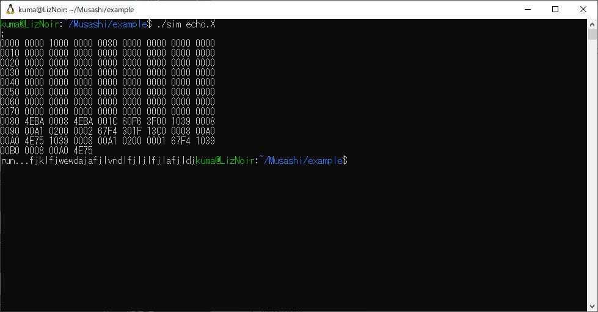

# emu68kplus emulator (based on Musashi)

68008搭載のSBC(Single Board Computer) [emu68kplus](https://github.com/tendai22/emu68kplus.git)のシミュレータです。Linux/MacOS上で動作します。

## 概要

emu68kplus SBCは、68008, 128k SRAM, PIC18F47Q43の3チップ構成のSBCです。PICがUARTのエミュレーションを行います。

本シミュレータでは、ROM領域なし、RAM領域128kB(00000 - 1FFFF)を持ちます。

UARTは、
|address|desripton|
|--|--|
|800A0|Data Register<br>Read: Received Data<br>Write: Transmitting Data|
|800A1|Control Register<br>b0: RxRDY(1:ready, 0:not ready)<br>b1: TxRDY(1:ready, 0:not ready)|
|||

## 使い方

引数にダンプファイルを指定して起動すると、ダンプ後実行を開始します。

```
% ./sim echo.X
```
この時の`echo.X`は以下の感じです。
```
=0 0000 1000
=4 0000 0080
=80 4eba 0008
=84 4eba 001c
=88 60f6
=8a 3f00
=8c 1039 0008 00a1
=92 0200 0002
=96 67f4
=98 301f
=9a 13c0 0008 00a0
=a0 4e75
=a2 1039 0008 00a1
=a8 0200 0001
=ac 67f4
=ae 1039 0008 00a0
=b4 4e75
!
```
`={address}`で書き込みアドレスを指定して、通常の16進文字列が書き込みデータを表します。最後の`!`はRAMダンプ命令で、これまでに書き込んだアドレス範囲でダンプします。

このプログラムはUARTから1バイト読み込み、読み込んだデータをUARTに書き出すもので、実行すると、`run...`まで出力しユーザ入力を待ちます。入力をエコーバック後、`ESC`を入力すると実行を停止しシェルプロンプトに戻ります。



> シェルプロンプト後キーを叩いても何も表示されない場合、プログラム終了処理に失敗しています。エコーバックなしですが、`stty sane^CR`とたたいてみましょう。これでエコーバックが復帰するはずです。

## ビルド方法

ディレクトリ`example`の下で`make`を実行するだけでよいです。

```
% cd example
% make
```

`example`の中にファイル`sim`が生成されます。これに引数を付けて実行するとよいです。

```
% ./sim echo.X
```

